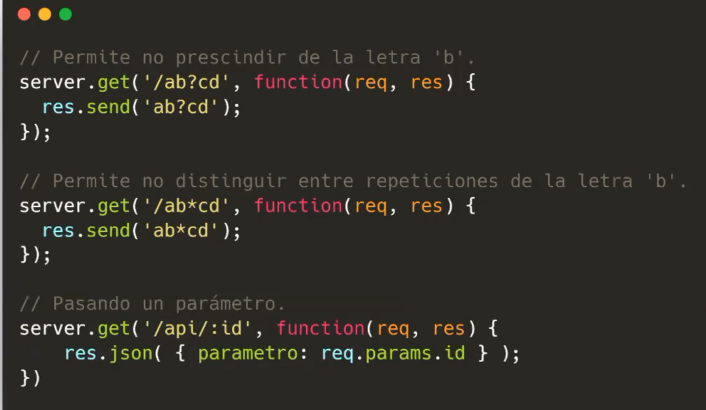
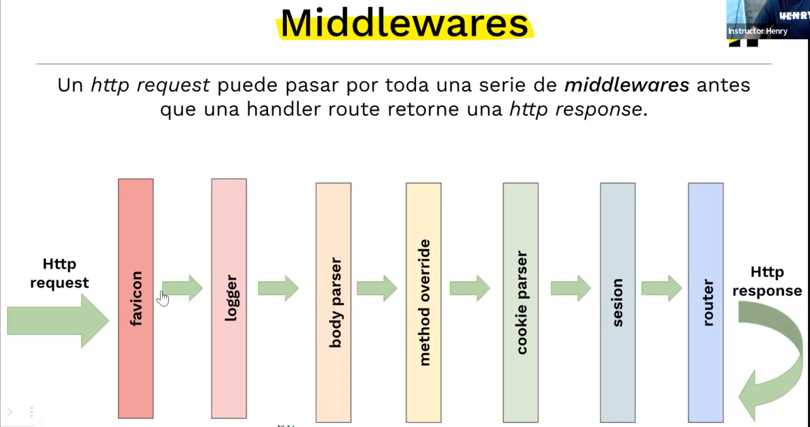

<h1>IMPORTANTE LEER PRIMERO</h1>

Buenaaaaaaas a quien lea estooop, y espero que estes muy bien :)

primero que nada, antes de iniciar a utilizar Express hay que instalarlo

npm init -y  <--  para crear el package.json

npm install express <-- para instalarlo

npm install nodemon

 
 

.
<h2>1 : los apuntes comienzan en server.js</h2>
 
server.js se divide en 3 secciones
 
<ul>
     
    <li>Middlewares</li>
     
    <li>Routes</li>
     
    <li>Listen</li>
</ul>
 
 

recomendable seguir los numeros en orden para guiarse como se debe hacer el paso a paso

referencia: 
 
//*1
 
//*2
 
//etc...
 
 
para apuntes de IA con:
 
//?1 apunte de IA
 
//?2 apunte de IA

 
 
 

detallitos extras, no tan importantes
 
<h2>!4!</h2>
 

 
 

<h2>!10!</h2>
 

